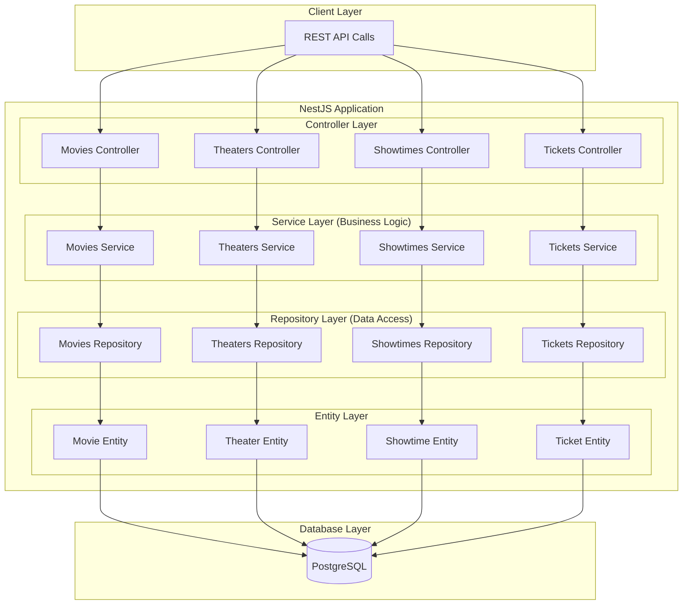
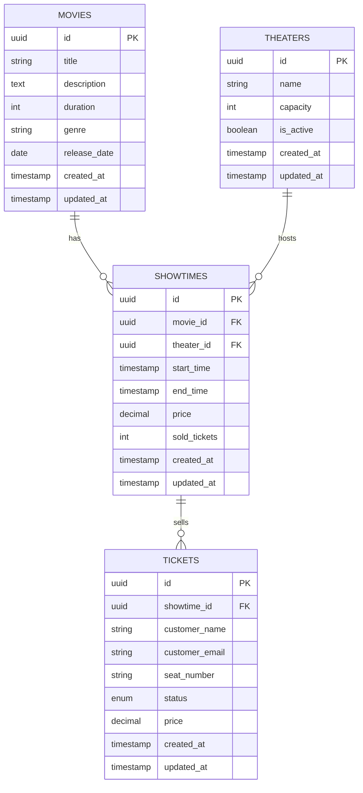
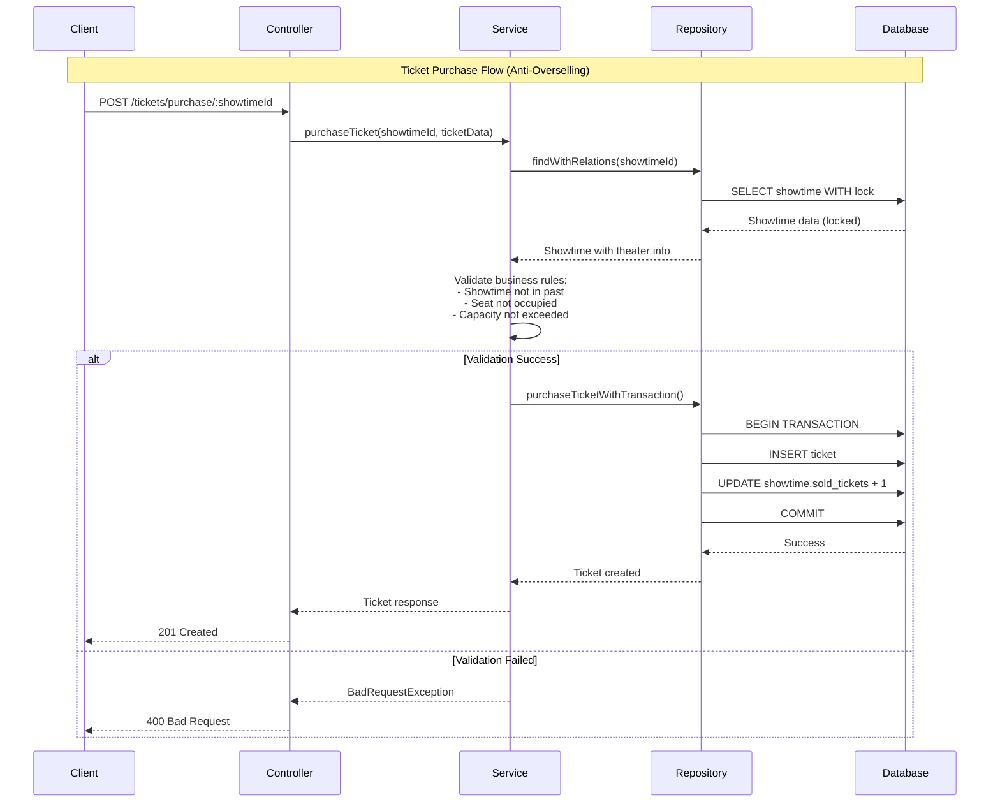

# 🎬 Cinema Booking System

A robust RESTful API for cinema ticket booking system built with NestJS, TypeORM, and PostgreSQL. This system manages movies, theaters, showtimes, and ticket sales with comprehensive business logic validation including anti-overselling protection.

## 📋 Table of Contents

- [Features](#features)
- [Architecture Overview](#architecture-overview)
- [Technology Stack](#technology-stack)
- [System Architecture](#system-architecture)
- [Database Schema](#database-schema)
- [Business Logic Flow](#business-logic-flow)
- [Project Structure](#project-structure)
- [Prerequisites](#prerequisites)
- [Installation & Setup](#installation--setup)
- [Environment Variables](#environment-variables)
- [Scripts](#scripts)
- [API Documentation](#api-documentation)
- [Core Business Rules](#core-business-rules)
- [Library Choices](#library-choices)

## ✨ Features

- **Movies Management**: Full CRUD operations for movie catalog
- **Theater Management**: Theater configuration with capacity management
- **Showtime Scheduling**: Smart scheduling with conflict detection
- **Ticket Booking**: Anti-overselling ticket purchasing system
- **Business Logic Validation**: Comprehensive validation for all operations
- **Pagination & Filtering**: Advanced querying capabilities
- **Swagger Documentation**: Auto-generated API documentation
- **Database Migrations**: Version-controlled database schema
- **Seed Data**: Development data seeding

## 🏗️ Architecture Overview

This project follows **Clean Architecture principles** with clear separation of concerns:

### **API Layer (REST)**

- Module-based NestJS architecture
- Controller → Service → Repository pattern
- DTO validation with `class-validator`
- Swagger documentation

### **Business Logic Layer**

- Services contain all business rules
- Validation of business constraints
- Error handling and transformation

### **Data Access Layer**

- Repository pattern for database abstraction
- TypeORM with PostgreSQL
- Transaction management for critical operations

### **Infrastructure**

- Docker containerization
- Database migrations
- Environment configuration

## 🛠️ Technology Stack

| Technology     | Purpose                   | Version   |
| -------------- | ------------------------- | --------- |
| **NestJS**     | Backend Framework         | ^11.0.1   |
| **TypeORM**    | ORM & Database Management | ^0.3.26   |
| **PostgreSQL** | Primary Database          | 14-alpine |
| **Docker**     | Containerization          | Latest    |
| **TypeScript** | Programming Language      | ^5.7.3    |
| **Swagger**    | API Documentation         | ^11.2.0   |
| **Jest**       | Testing Framework         | ^29.7.0   |

## 🏛️ System Architecture



## 🗄️ Database Schema



## 🔄 Business Logic Flow



## 📁 Project Structure

```
src/
├── 📁 common/                    # Shared utilities and DTOs
│   ├── dto/
│   │   ├── pagination.dto.ts
│   │   ├── paginated-response.dto.ts
│   │   └── success-response.dto.ts
│   └── interfaces/
├── 📁 database/                  # Database related files
│   ├── migrations/               # TypeORM migrations
│   └── seeds/                    # Database seeding
│       ├── seed.ts              # Complete seed script
│       └── quick-seed.ts        # Development seed
├── 📁 movies/                    # Movies module
│   ├── dto/                     # Data Transfer Objects
│   │   ├── create-movie.dto.ts
│   │   ├── update-movie.dto.ts
│   │   ├── movie-response.dto.ts
│   │   └── movie-search.dto.ts
│   ├── entities/
│   │   └── movie.entity.ts
│   ├── interfaces/
│   │   └── movies-repository.interface.ts
│   ├── repositories/
│   │   └── movies.repository.ts
│   ├── movies.controller.ts     # REST endpoints
│   ├── movies.service.ts        # Business logic
│   └── movies.module.ts         # Module definition
├── 📁 theaters/                  # Theaters module
│   ├── dto/
│   ├── entities/
│   ├── interfaces/
│   ├── repositories/
│   ├── theaters.controller.ts
│   ├── theaters.service.ts
│   └── theaters.module.ts
├── 📁 showtimes/                 # Showtimes module
│   ├── dto/
│   ├── entities/
│   ├── interfaces/
│   ├── repositories/
│   ├── showtimes.controller.ts
│   ├── showtimes.service.ts
│   └── showtimes.module.ts
├── 📁 tickets/                   # Tickets module
│   ├── dto/
│   ├── entities/
│   ├── interfaces/
│   ├── repositories/
│   ├── tickets.controller.ts
│   ├── tickets.service.ts
│   └── tickets.module.ts
├── app.controller.ts
├── app.service.ts
├── app.module.ts                # Root module
└── main.ts                      # Application entry point
```

## 🔧 Prerequisites

- **Node.js** >= 18.x
- **Docker** & **Docker Compose**
- **Git**

## 🚀 Installation & Setup

### Method 1: Docker (Recommended)

```bash
# 1. Clone the repository
git clone <repository-url>
cd cinema-booking-system

# 2. Create environment file
cp .env.example .env

# 3. Build and run with Docker Compose
docker-compose up --build

# 4. Run database migrations (in another terminal)
docker-compose exec app npm run migration:run

# 5. Seed the database with sample data
docker-compose exec app npm run db:seed
```

### Method 2: Local Development

```bash
# 1. Clone and install dependencies
git clone <repository-url>
cd cinema-booking-system
npm install

# 2. Setup PostgreSQL database locally
# Ensure PostgreSQL is running on localhost:5432

# 3. Create environment file
cp .env.example .env

# 4. Run migrations and seed data
npm run migration:run
npm run db:seed

# 5. Start the development server
npm run dev
```

## 🌍 Environment Variables

Create a `.env` file in the root directory:

```env
# Database Configuration
DB_HOST=localhost                 # Use 'db' for Docker
DB_PORT=5432
DB_USERNAME=admin
DB_PASSWORD=admin
DB_DATABASE=cinema_db

# Application Configuration
NODE_ENV=development
PORT=3000
```

### Docker Compose Services

The `docker-compose.yml` includes:

| Service | Description         | Port |
| ------- | ------------------- | ---- |
| **app** | NestJS Application  | 3000 |
| **db**  | PostgreSQL Database | 5432 |

**Volumes:**

- `db_data`: Persistent database storage
- `./:/usr/src/app`: Live code reloading for development

## 📜 Scripts

### Development Scripts

```bash
npm run dev              # Start development server with hot reload
npm run build           # Build the application
npm run start           # Start production server
npm run start:prod      # Start optimized production server
```

### Database Scripts

```bash
npm run migration:generate -- MigrationName  # Generate new migration
npm run migration:run                        # Run pending migrations
npm run migration:revert                     # Revert last migration
npm run migration:show                       # Show migration status
npm run schema:drop                          # Drop entire schema
npm run db:seed                             # Seed database with sample data
```

### Docker Scripts

```bash
docker-compose up --build    # Build and start all services
docker-compose down          # Stop all services
docker-compose logs app      # View application logs
docker-compose logs db       # View database logs
```

### Testing Scripts

```bash
npm run test            # Run unit tests
npm run test:watch      # Run tests in watch mode
npm run test:cov        # Run tests with coverage
npm run test:e2e        # Run end-to-end tests
```

## 📖 API Documentation

Once the application is running, access the interactive API documentation:

**Swagger UI**: http://localhost:3000/api/docs

### Key Endpoints

| Module        | Endpoint                                  | Description                         |
| ------------- | ----------------------------------------- | ----------------------------------- |
| **Movies**    | `GET /movies`                             | List movies with pagination/filters |
|               | `POST /movies`                            | Create new movie                    |
|               | `GET /movies/:id`                         | Get movie details                   |
| **Theaters**  | `GET /theaters`                           | List theaters with pagination       |
|               | `POST /theaters`                          | Create new theater                  |
|               | `PATCH /theaters/:id/activate`            | Activate theater                    |
| **Showtimes** | `GET /showtimes`                          | List showtimes with filters         |
|               | `POST /showtimes`                         | Create new showtime                 |
|               | `GET /showtimes/:id/availability`         | Check seat availability             |
| **Tickets**   | `POST /tickets/purchase/:showtimeId`      | Purchase ticket                     |
|               | `GET /tickets/occupied-seats/:showtimeId` | Get occupied seats                  |
|               | `PATCH /tickets/:id/cancel`               | Cancel ticket                       |

## ⚖️ Core Business Rules

### 🎬 Movies

- Unique title per release date
- Release date between 1900 and max 2 years in future
- Duration between 1-600 minutes
- Cannot delete movies with upcoming showtimes

### 🏛️ Theaters

- Unique theater names
- Capacity between 1-1000 seats
- Cannot reduce capacity below sold tickets
- Cannot delete theaters with upcoming showtimes

### 🎭 Showtimes

- **Cannot create showtimes in the past**
- **No scheduling conflicts** - same theater cannot have overlapping showtimes
- End time calculated automatically based on movie duration
- Cannot delete showtimes with sold tickets
- Cannot update showtimes that have already started

### 🎫 Tickets

- **Anti-overselling protection** - cannot exceed theater capacity
- **Pessimistic locking** prevents race conditions
- Cannot purchase for past/ongoing showtimes
- Seat numbers must be unique per showtime
- Atomic transactions ensure data consistency
- Cannot cancel tickets for past showtimes

## 📚 Library Choices

### Core Framework & Database

- **`@nestjs/core`** - Robust, scalable Node.js framework with TypeScript support and dependency injection
- **`typeorm`** - Mature ORM with excellent TypeScript support, migrations, and relationship handling
- **`pg`** - PostgreSQL client for Node.js, reliable and performant

### Validation & Transformation

- **`class-validator`** - Decorator-based validation, perfect for DTOs with comprehensive validation rules
- **`class-transformer`** - Works seamlessly with class-validator for object transformation and serialization
- **`@nestjs/swagger`** - Auto-generates API documentation from decorators, saves development time

### Date & Time Management

- **`date-fns`** - Lightweight, modular date library chosen over Moment.js for:
  - Smaller bundle size (tree-shakeable)
  - Immutable date operations
  - Better TypeScript support
  - Functional programming approach
  - Critical for showtime scheduling and business rule validations

### Development & Build Tools

- **`typescript`** - Type safety and better developer experience
- **`eslint` & `prettier`** - Code quality and consistent formatting
- **`jest`** - Testing framework with excellent TypeScript support

### Configuration & Environment

- **`@nestjs/config`** - Environment variable management with validation
- **`reflect-metadata`** - Required for TypeScript decorators used by NestJS and TypeORM

## 🚦 Getting Started Quick Guide

1. **Clone and setup**:

   ```bash
   git clone <repo> && cd cinema-booking-system
   cp .env.example .env
   ```

2. **Start with Docker**:

   ```bash
   docker-compose up --build
   ```

3. **Setup database** (in new terminal):

   ```bash
   docker-compose exec app npm run migration:run
   docker-compose exec app npm run db:seed
   ```

4. **Access the application**:
   - API: http://localhost:3000
   - Documentation: http://localhost:3000/api/docs

5. **Test the API**:

   ```bash
   # Get all movies
   curl http://localhost:3000/movies

   # Purchase a ticket
   curl -X POST http://localhost:3000/tickets/purchase/{showtime-id} \
     -H "Content-Type: application/json" \
     -d '{"customer_name": "John Doe", "customer_email": "john@example.com", "seat_number": "A-1"}'
   ```

---

**🎉 Happy coding!** For questions or issues, please check the API documentation at `/api/docs` or review the business logic validation in the service layers.
